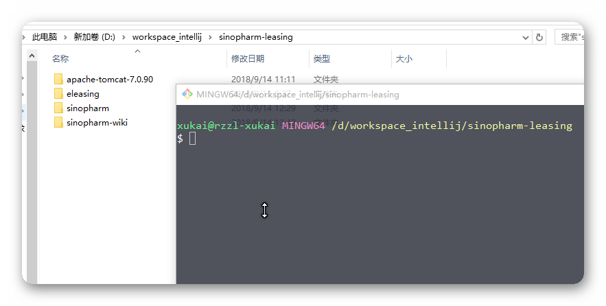
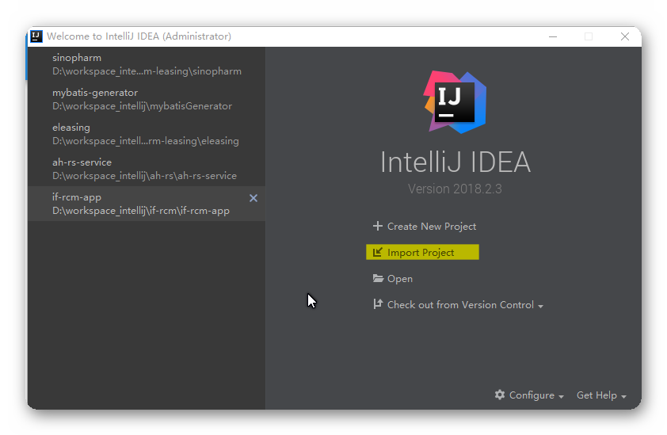
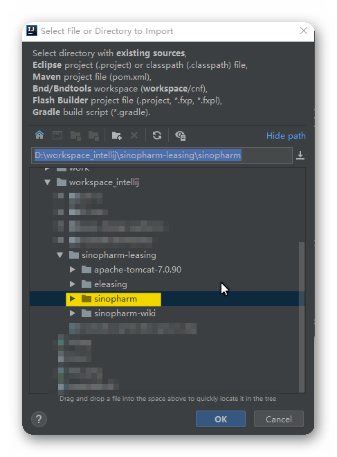

title: 代码拉取并导入
description: 代码拉取并导入
source: Share/leasingSystem/environment/downloadCode.md

# 代码拉取并导入

---

##1. 代码拉取

1. 进入你想存放代码的路径。右击打开git bash

    !!! tip "gitbash"
        

2. 克隆代码
   
    在git bash中输入

        git clone git@git2.tenwa.com.cn:sinopharm/sinopharm.git

    录入用户名及密码，即可。

3. 切换开发分支
   
    在git bash中输入

        git checkout fundDev
    
---

##2. 代码导入

1. 打开intellij,选择导入

    !!! tip "intellij"
        
   
2. 选择代码路径，完成导入

    !!! tip "intellij"
        