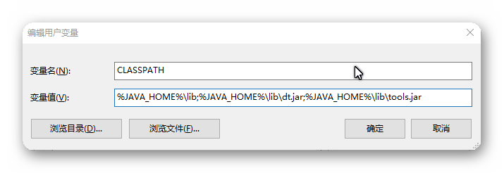
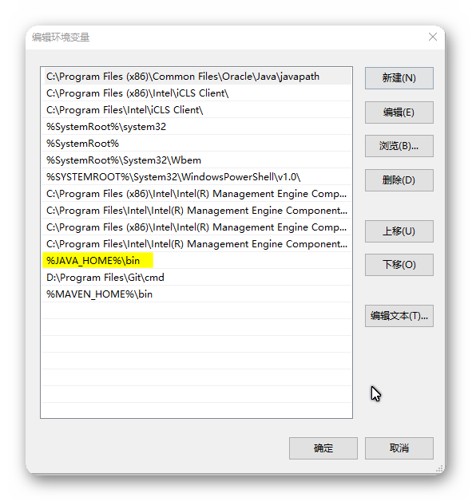
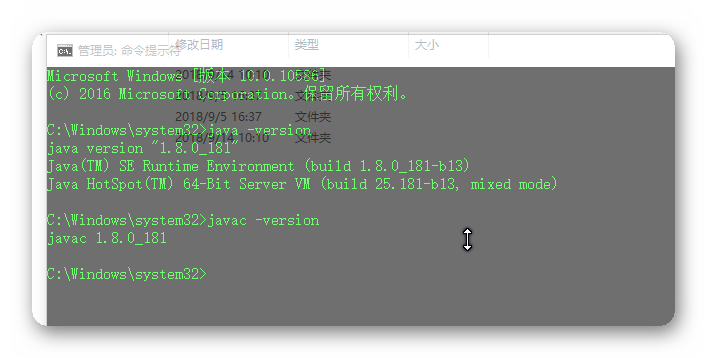
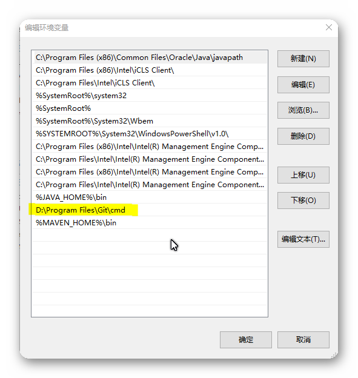

title: 系统搭建前准备
description: 系统搭建前准备
source: Share/leasingSystem/environment/program.md

# 软件准备

---

!!! summary "软件列表"
    | 软 件 名 称 | 下 载 地 址 |
    |------------|------------|
    | jdk1.7及以上 | ^^file://10.42.0.147/share/共享文件/信息部/软件下载/jdk-8u181-windows-x64.exe^^ |
    | tomcat7(非7的都存在异常) | ^^file://10.42.0.147/share/共享文件/信息部/软件下载/apache-tomcat-7.0.90.zip^^ |
    | Intellij |  ^^https://www.jetbrains.com/idea^^ |
    | Oracle |  ^^https://www.oracle.com/technetwork/cn/database/features/instant-client/index-092699-zhs.html^^ |
    | git |  ^^file://10.42.0.147/share/共享文件/信息部/软件下载/Git-2.18.0-64-bit.exe^^ |

---

##1. jdk 

###1. 安装jdk
   
###2. 配置环境变量
   
1. JAVA_HOME
    设置你jdk的安装目录。

??? tip "JAVA_HOME"
    
        
2. CLASSPATH
   
??? tip "CLASSPATH"
    %JAVA_HOME%\lib;%JAVA_HOME%\lib\dt.jar;%JAVA_HOME%\lib\tools.jar
    

3. Path
   
??? tip "Path"
    %JAVA_HOME%\bin
    

###3. 验证jdk是否安装成功

??? tip "test"
    

---

##2. tomcat

    下载文件,解压到你指定的路径即可。

---

##3. Intellij

    下载文件，并安装，安装过程中激活码可先跳过。

---

##4. Oracle客户端

    下载文件，并安装。

---

##5. git

###1. 安装git

###2. 配置环境变量

安装时，若选择自动配置环境变量，可忽略这一步。

??? tip "test"
    